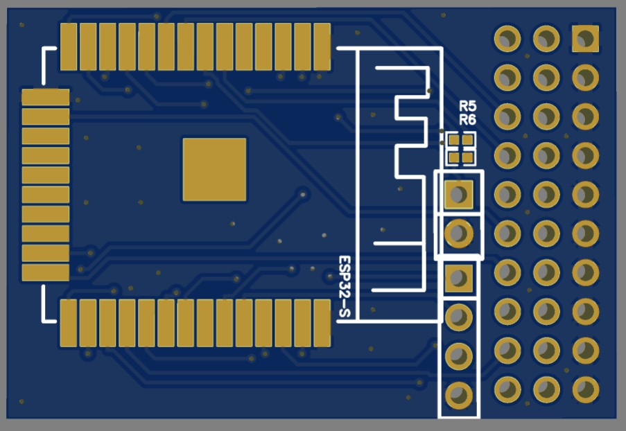
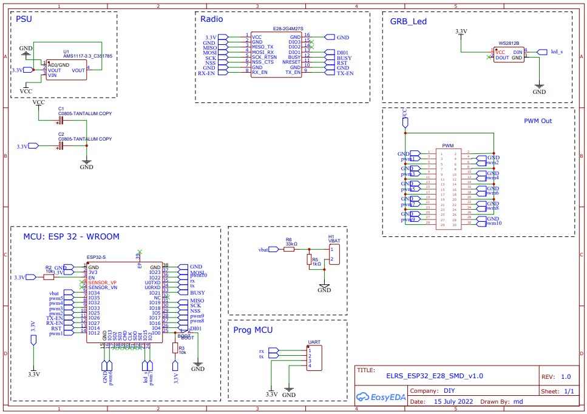

# ESP32 E28 10ch RX

### PCB manufacturing

Upload the Gerber file to https://jlcpcb.com.  Check the price for 5, 10, and 30 pieces.  It is sometimes cheaper to order 30 than 10 and only a minor increase in price compared to 5.

*PCB Thickness: 1mm*

### BOM

- E28-2G4M27S Wireless module 2.4G https://www.aliexpress.com/item/1005003462278359.html
- AMS1117 3.3V Power Reg https://www.aliexpress.com/item/32910803907.html
- ESP32 https://www.aliexpress.com/item/1005003107028039.html
- C1 3528 16V 10uF-100uF Tantalum Capacitor
- C2 3528 10V 10uF-100uF Tantalum Capacitor (optional)
- R1 1206 10K
- R2 1206 10K
- R5 0805 1K Resistor
- R6 0805 33K Resistor
- WS2812 LED
- Button https://www.aliexpress.com/item/1005004288250103.html

### Build order

- Solder the E28 module
- Solder the ESP32 module
- Solder the WS2812 led
- Solder the button
- Solder the small passive components (capacitors and resistors)
- Solder the Vreg
- Solder teh 2.54mm headers
- Done

### Schematic and PCB layout

  

### Flashing 

- Connect an FTDI to the GND, 3.3V, TX and RX pins on the header, then hold the boot button while powering up (or just bridge the pads), and flash the DIY_2400_RX_ESP8285_SX1280_via_UART target in the ExpressLRS Configurator or using PlatformIO
