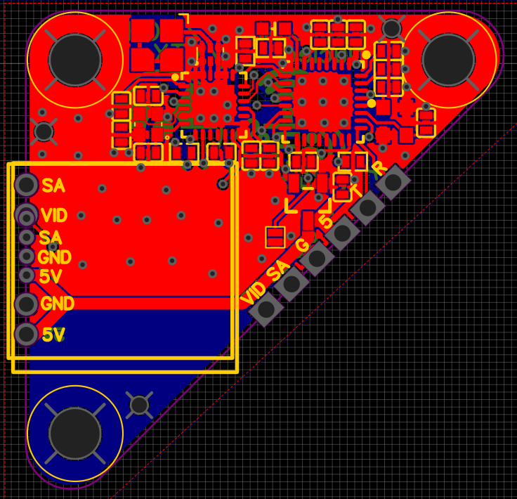
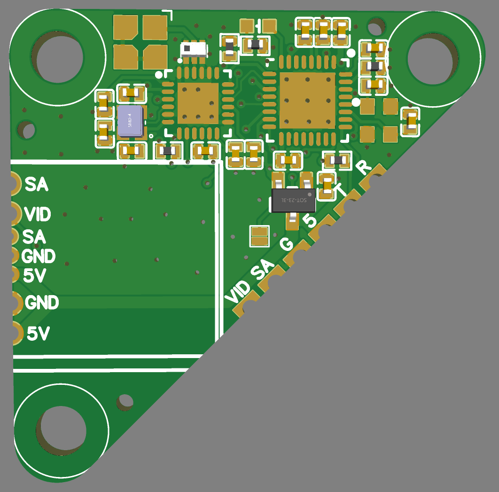
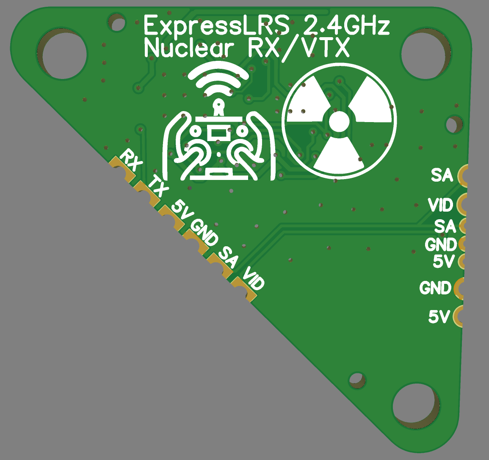

Same as Nuclear RX but 25x25 stack mounting and a spot for directly mounting a EWRF E7082VM or a TBS Unify.

Should be able to be assembled by JLC also.

Default options except:
Thickness "1.2mm"
Color "Green"
Remove Order Number "Specify a location"

