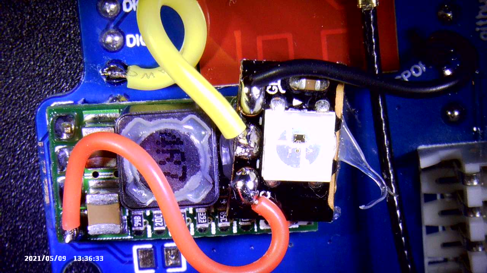
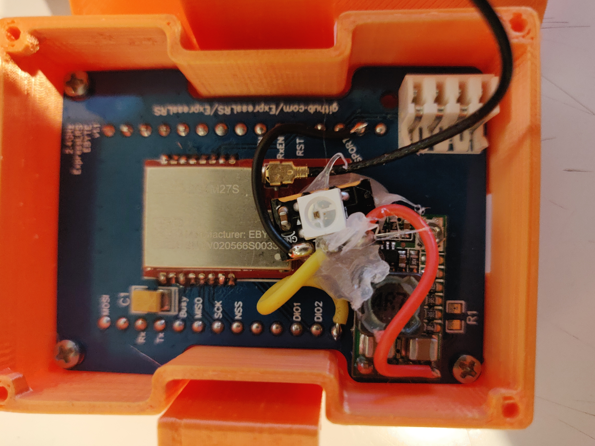
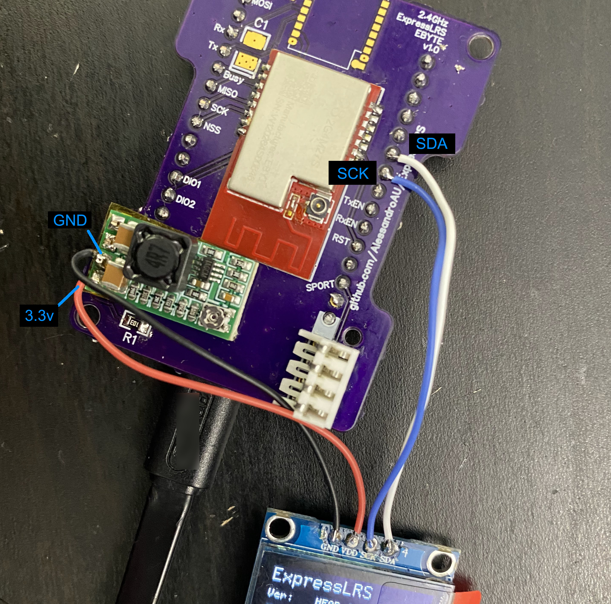

# 2.4 GHz Tx

There are 2 different PCB design based on the G-NiceRF_LoRa1280 (12.5dBm) and EBYTE_E28-2G4M27S (27dBm).

### PCB manufacturing

Upload the Gerber file to https://jlcpcb.com/RAT.  Check the price for 5, 10, and 30 pieces.  It is sometimes cheaper to order 30 than 10 and only a minor increase in price compared to 5.

*PCB Thickness: 1mm*

*Remove Order Number: Specify a location*

### BOM E28-2G4M27S

- E28-2G4M27S SX1280 Wireless module 2.4G 27dBm https://www.aliexpress.com/item/33004335921.html
- ESP32 30 Pin Development Board https://www.aliexpress.com/item/1005001635370174.html
- 3.3V DC-DC Step Down Power Supply https://www.aliexpress.com/item/32880983608.html
- 10k 0805 resistor https://www.aliexpress.com/item/4000049692396.html
- SMA or RPSMA connector https://www.aliexpress.com/item/4000848776660.html https://www.aliexpress.com/item/4000848776660.html
- 2.4 Ghz antenna that matches your antenna connector https://www.aliexpress.com/item/33030015823.html
- KK 254 PC Board Connector https://www.molex.com/molex/products/part-detail/pcb_receptacles/0022142044 https://www.digikey.com/en/products/detail/molex/0022142044/26523

### Build order

- Solder the 4 pin molex connector.  Cut the pins flush with the PCB before soldering.
- Apply tape to the base of the esp32 board to insulate it from potentially shorting with the molex pins.  Remove the black plastic standoffs.  Place on the PCB and cut the pins flush then solder.
- Set the regulator voltage to 3.45V by rotating the potentiometer on the top fully clockwise, and jumper both the 5V and 12V pads on the back.  Why didn't we just jumper the 3.3V?  Because that also requires cutting the ADJ trace and potentially damaging the regulator.  The e28 will also run better on a voltage slightly above 3.3V.  Now remove the black standoff, insulate the base with tape, then solder in place.

- Solder the 10k resistor.
- Solder the e28 module.  Dont forget to change the zero ohm resistor near the ufl.  Default is to use the PCB antenna, it must be repositioned to use the ufl.

    
 

### I can haz RGB

- Cut a single RGB LED from one of those flexible LED Strips (WS2812B RGB LED)
- Solder the wires as shown in the picture
- Hot glue the LED down to stop it flapping about in the breeze and potentially shorting something

 

### Adding an I2C OLED

*Your DIY module must be running master. I2C OLED is not supported under v2.0.1.*

This is tested with an I2C SSD1306 OLED display.

- Attach wires to SDA, SCK, GND and 3.3v.
- Add -DUSE_OLED_I2C to your defines.
- The module should activate on boot.

### Adding a TX backpack

2.4GHz ExpressLRS EBYTE v1.0 parts:
1x ESP-01F (ESP8285) https://www.aliexpress.com/item/2255801122884432.html
1x 30mm wire antenna (or antenna often included with ESP-01F)

build with ESP-01F:
-use FTDI to flash HappyModel_TX_Backpack_via_UART to the ESP-01F prior to soildering onto the TX PCB (future flash via WiFi). 

-install ESP-01F onto TX PCB so that the corner cutout of RF shield aligns with corner cutout of silkscreen.

-optional: add a Normally Open push button for boot mode and WiFi mode togle.
-optional: add backpack status LED and resistor connected between pad IO16 of ESP-01F and ground.
-altenately: an ESP based RX can be converted for use as a TX backpack and connected to the pads circled

