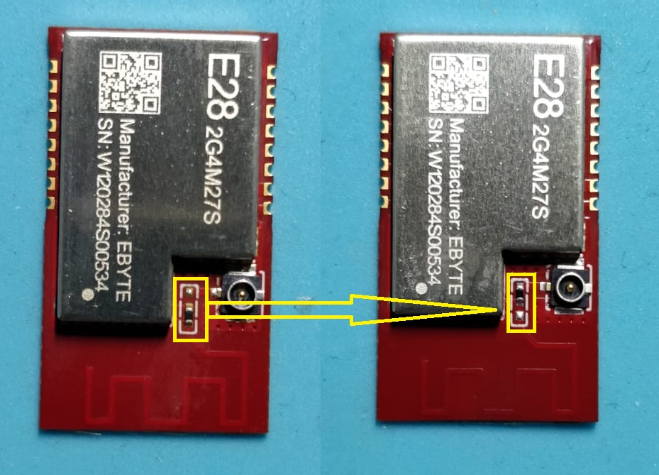
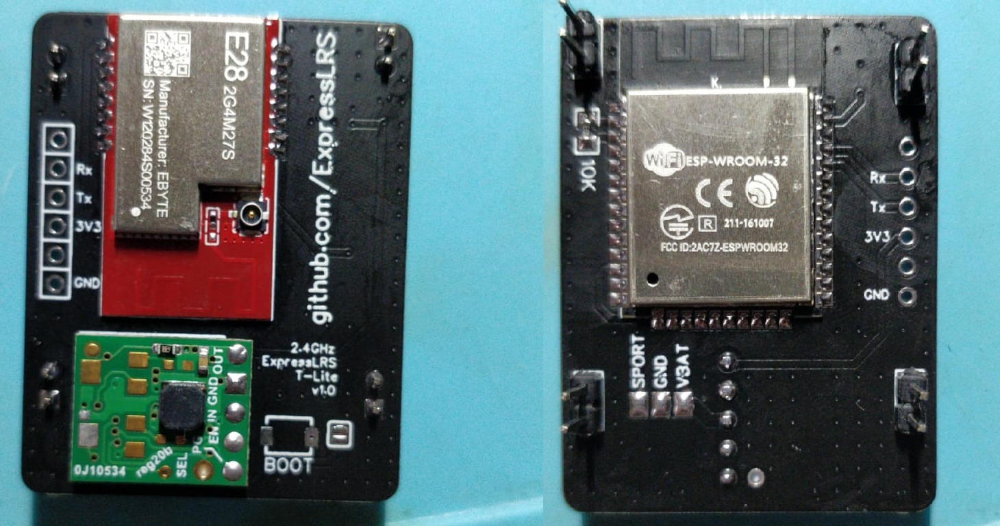
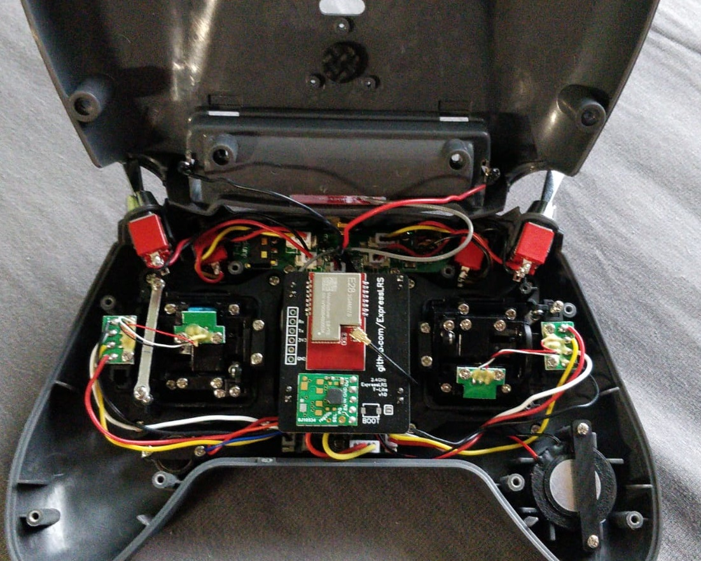
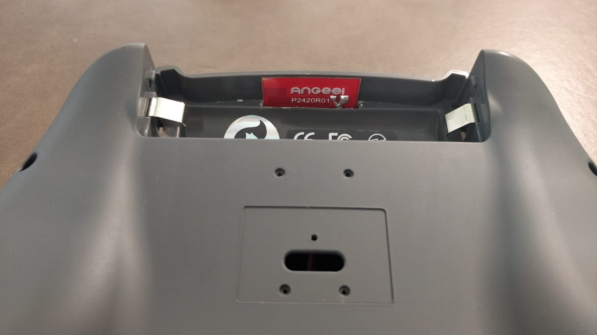
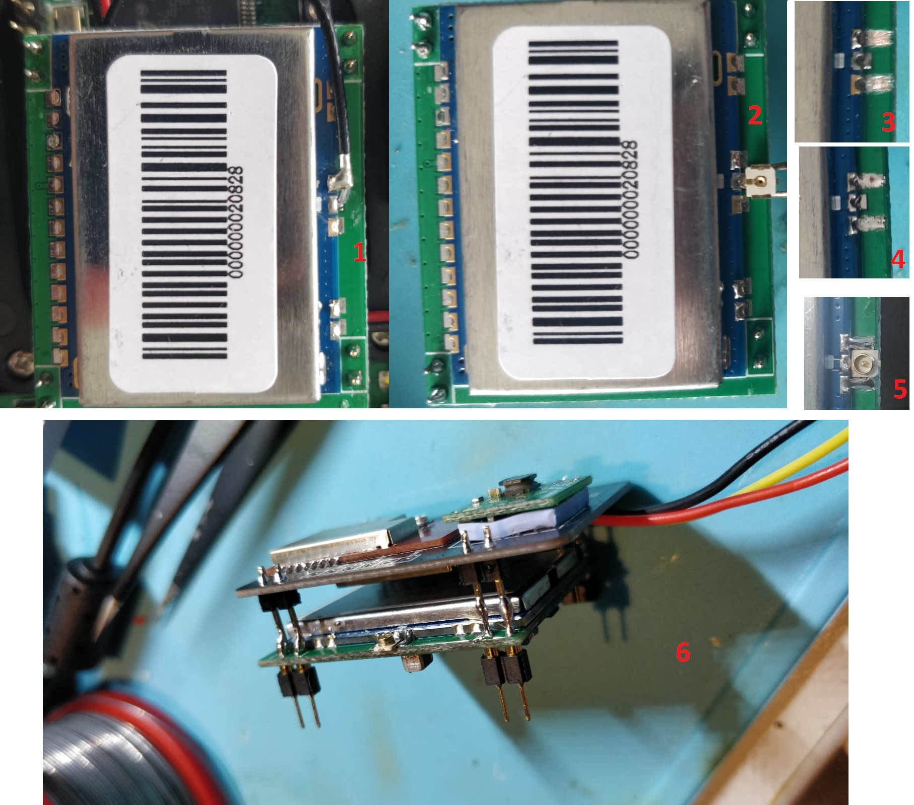

# Jumper TLite 2.4 GHz Tx

This internal module is a remix of the slim module.  Please check out that readme for further details on parts and flashing.

This module uses a separate step up/down regulator directly from vbat, so it does not have any output power limitations that typical external modules may have.

https://easyeda.com/jyesmith/expresslrs-jumper-t-lite

### PCB manufacturing

Upload the Gerber file to https://jlcpcb.com/RAT.  Check the price for 5, 10, and 30 pieces.  It is sometimes cheaper to order 30 than 10 and only a minor increase in price compared to 5.

*PCB Thickness: 1mm*

### PCB Order Details

### BOM

Parts used are the same as the slim modules except for the step up/down regulator.

- E28-2G4M27S SX1280 Wireless module 2.4G 27dBm https://www.aliexpress.com/item/33004335921.html
- Pololu S9V11F3S5C3 https://www.pololu.com/product/2873
- 10k 0805 resistor https://www.aliexpress.com/item/4000049692396.html
- SMA or RPSMA connector https://www.aliexpress.com/item/4000848776660.html https://www.aliexpress.com/item/4000848776660.html
- WROOM32 module https://www.aliexpress.com/item/ESP32-ESP-32S-WIFI-Bluetooth-Module-240MHz-Dual-Core-CPU-MCU-Wireless-Network-Board-ESP-WROOM/4000230070560.html

### Build

Dont forget to change the zero ohm resistor near the ufl.  Default is to use the PCB antenna, it must be repositioned to use the ufl.

Build and flashing video https://youtu.be/8L0xCDgLQ8s

### Internal Module (Replace)

### Internal Module (Stack)

The ExpressLRS module uses the RP-SMA pigtail to use a FrSky 2.4GHz T-antenna of a Taranis X-Lite.

Here a slot was milled into the battery compartment and the internal antenna of a Frsky X-Lite was used, this is self-adhesive. Type PW2420A. https://www.banggood.com/FrSky-Taranis-X-Lite-Transmitter-Parts-Replacement-2_4Ghz-Internal-Antenna-for-RC-Drone-p-1355971.html?rmmds=myorder&cur_warehouse=CN

A ufl connector was soldered to the jp4in1 module to use the internal antenna.

Here you can see the Jumper T-Lite with the Module stack inside and 500hz @ 250mw.

