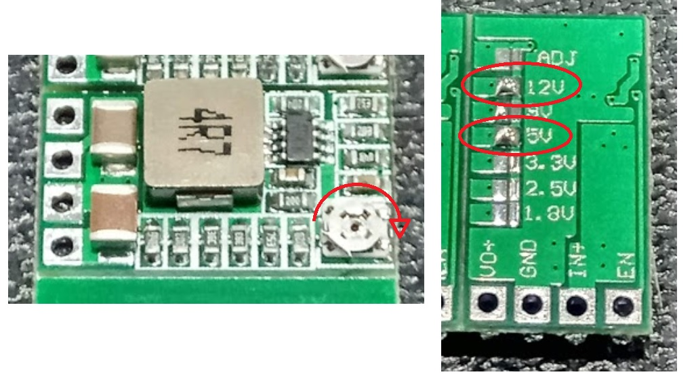
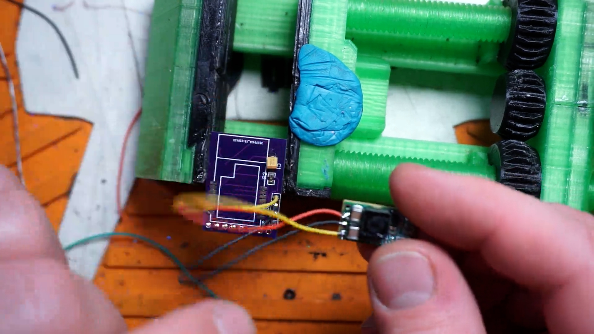
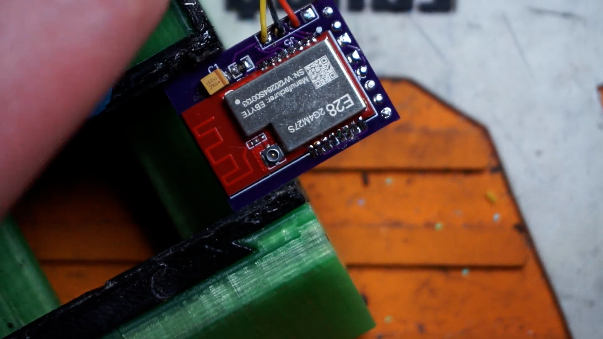
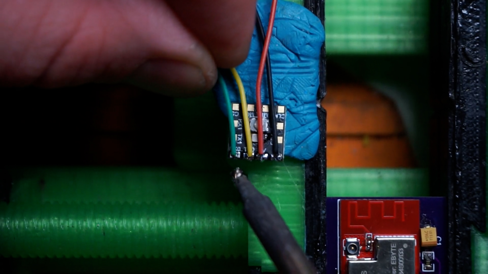
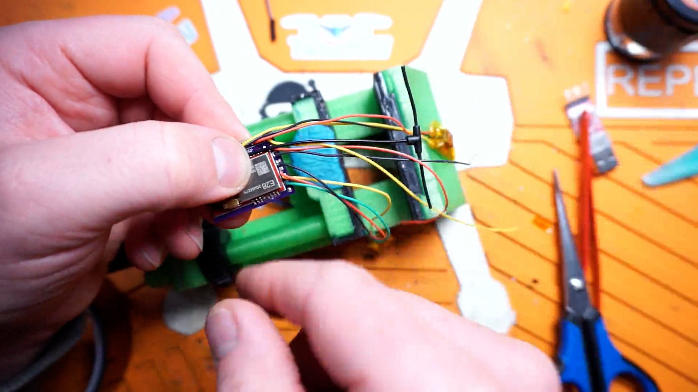
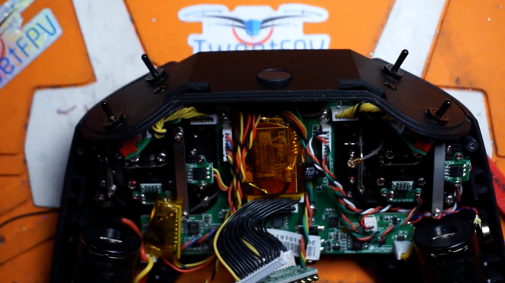
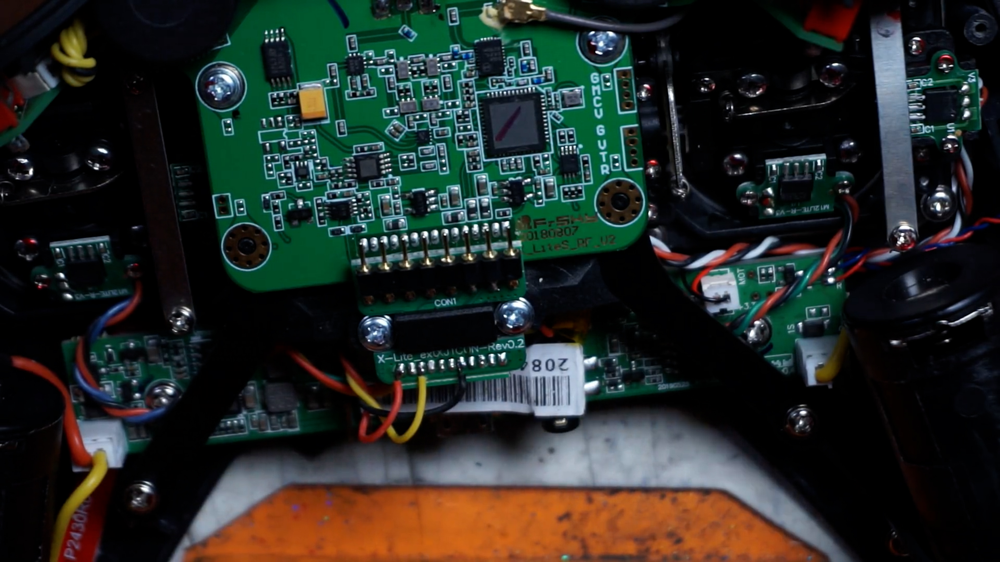
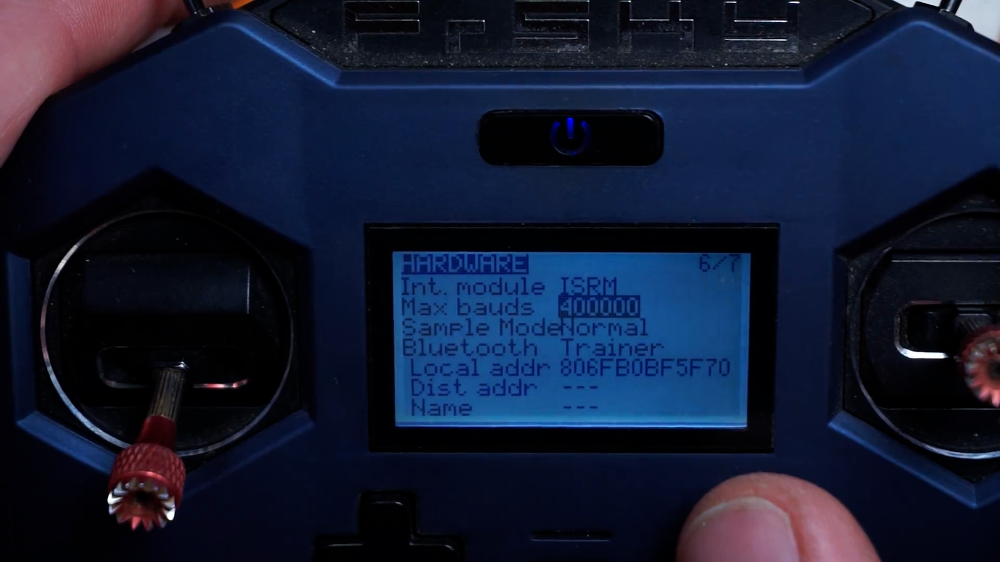

# 2.4GHz Tiny Tx

Very Tiny 2.4GHz eLRS Module to fit into the Frsky Xlite or other radio hand set.

### PCB manufacturing

Upload the Gerber file to https://jlcpcb.com  Check the price for 5, 10, and 30 pieces.  It is sometimes cheaper to order 30 than 10 and only a minor increase in price compared to 5.

*PCB Thickness: 1mm*

### BOM

- E28-2G4M27S SX1280 Wireless module 2.4G 27dBm https://www.aliexpress.com/item/33004335921.html
- 3.3V DC-DC Step Down Power Supply https://www.aliexpress.com/item/32880983608.html
- 10k 0805 resistor https://www.aliexpress.com/item/4000049692396.html
- 90mm U.fl antenna https://www.getfpv.com/happymodel-expresslrs-ep1-rx-2-4ghz-omnidirectional-u-fl-antenna-40mm-90mm.html?afid=aVlOV0hBdmd6THc9&in-stock=1&gclid=Cj0KCQiA3rKQBhCNARIsACUEW_bZMHds3mcqI4_r9OySdRcX8aWHpnh1jQqCntTh_0c700wi1lZptBYaApujEALw_wcB
- WROOM32 module https://www.aliexpress.com/item/ESP32-ESP-32S-WIFI-Bluetooth-Module-240MHz-Dual-Core-CPU-MCU-Wireless-Network-Board-ESP-WROOM/4000230070560.html
- 10uF 3528 Cap https://www.aliexpress.com/item/32666405364.html?algo_pvid=365ae59d-9e6c-46b7-9792-2656b0961f70&algo_expid=365ae59d-9e6c-46b7-9792-2656b0961f70-6&btsid=0bb0623116027669252885518ea610&ws_ab_test=searchweb0_0,searchweb201602_,searchweb201603_
- Happymodel EP82 (2 if you need one for your goggle VRX. If using the TBS Fusion you only need 1 EP82 since the Fusion has the hardware already built into the VRX module) https://usa.banggood.com/0_3g-Happymodel-EP82-Backpack-Module-10_5x10_5mm-for-Control-Rapidfire-VRX-with-ELRS-TX-Module-FPV-Racing-Freestyle-DIY-Parts-p-1919156.html?cur_warehouse=CN

### Build order

- Solder the 10k resistor
- Solder the capacitor
- Solder the WROOM32 module
- Flash firmware to the Module to see if the ESP32 works fine (Connect an FTDI to the Tiny ELRS U0 port GND=GND, 3.3=3,3V, TX=RX, RX=TX, B=GND pins on the left header and flash the DIY_2400_TX_ESP32_SX1280_E28_via_UART build in ELRS Configurator)
- Solder the e28 module. Don't forget to change the zero ohm resistor near the u.fl.  Default is to use the PCB antenna, it must be repositioned to use the ufl.
- Connect GND and 3,3 from the modules 3-pin header to the DC-DC regulators GND and VOUT.
- Connect GND and VIN from the regulator and SP from the module to the module-bay connector of the Frsky Xlite or which ever radio you are working on.
- Flash VTX backpack firmware to the EP82, Connect FTDI to the EP82 GND=GND, 3.3=3,3V, TX=RX, RX=TX (Select Backpack, target category as "TX" and device as "HappyModel TX Backpack. Flashing method as UART)
- Remove FTDI from EP82
- Connect an Ep82 to GND=GND, 3.3=3,3V, TX=RX, RX=TX on the Tiny ELRS board U0 port
- Connect 2.4GHz antenna to E28 module
- Wrap EP82, DC-DC regulator and Tiny ELRS PCB individually with kapton tape.
- Install into radio
- Connect Vbat, Ground, and S.Port wires on Tiny ELRS PCB to radios external bay.
- In opentx/EdgeTx set external RF to CRSF. In the hardware menu set baud rate to 400,000 

### Build Video
https://youtu.be/8ZfG6l0pAVU

### Build Pics

  
 
  
  

### Schematic and PCB layout

